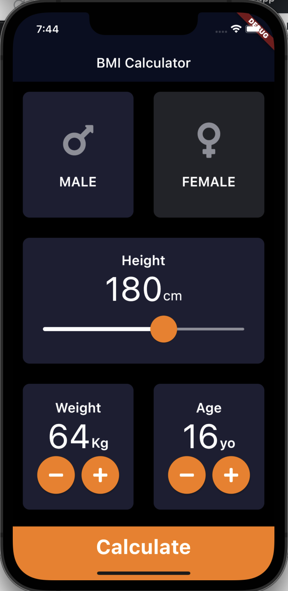

# BMI_calculator_app
This app is written with dart language using flutter framework. It takes gender,age, height and weight of a user and calculate Body mass index.

  

The result shows when calculate button is pushed.

  

